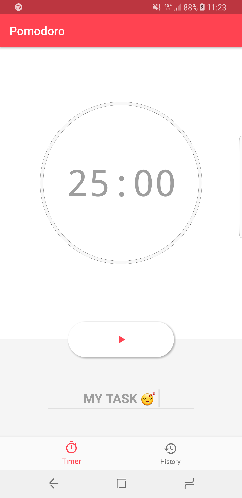
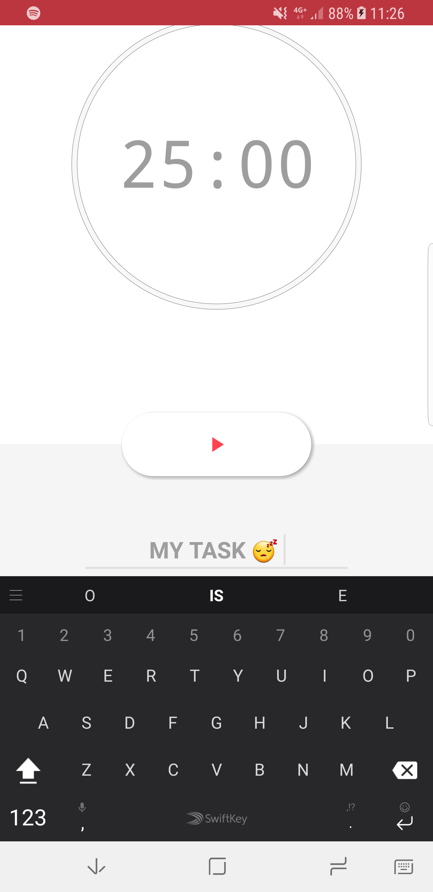
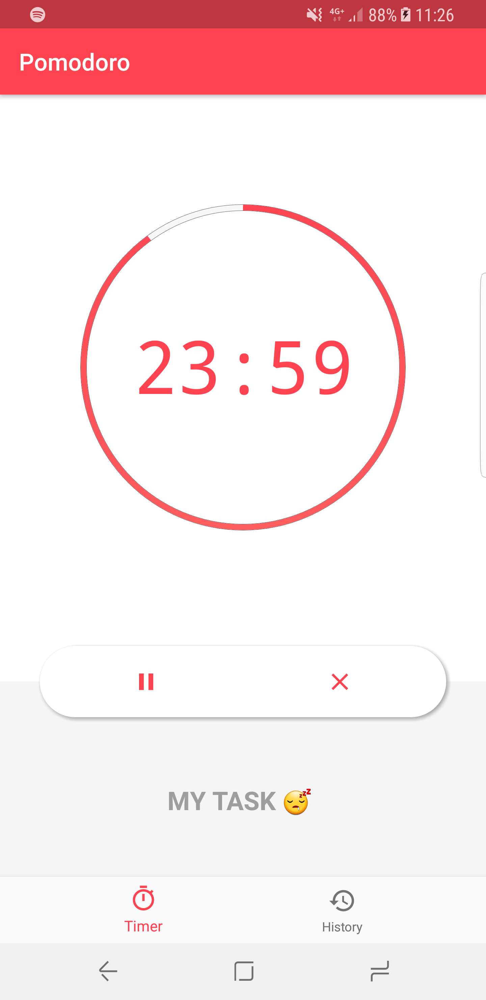

# Pomodoro

An open source app that let you be more organized with your time.

Accordingly to [Wikipedia](https://en.wikipedia.org/wiki/Pomodoro_Technique). The **Pomodoro Technique** is a time management method developed by Francesco Cirillo in the late 1980s. The technique uses a timer to break down work into intervals, traditionally 25 minutes in length, separated by short breaks. These intervals are named **\*pomodoros***, the plural in English of the Italian word *pomodoro* (tomato), after the tomato-shaped kitchen timer that Cirillo used as a university student.

### Features

- Create Pomodoro tasks of 25 minutes max
- Save all your taks done in one place
- Cancel a taks anytime you want
- Organize your tasks given names to them
- Control your task just using the notification area

### TO-DOS

- [ ] More flexible maximum time
- [ ] Organize tasks by subject
- [ ] Scheduler and reminders
- [ ] Better animations
- [ ] Google Account / Facebook / email  integration to save the tasks into the cloud

### Screenshots

   

### Instalation

Just follow the steaps bellow to install the app on your phone and you're good to go.

- [Donwload](APK/release.apk) the Promodoro .APK file
- Allow (at least once) unknown sources to install apps. (a pop-up will appear) 
- Click on install
- Enjoy!

#### Have fun and enjoy it! :)
